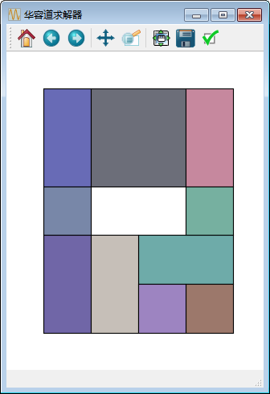
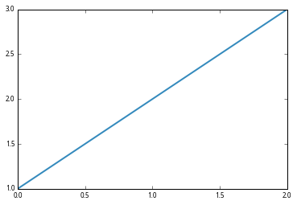

# Scpy2 - Python科学计算第二版实例代码集

`scpy2`为Python科学计算第二版的实例代码集，其中的包含许多演示代码以及一些实用的模块。

## Scipy

### 解华容道

演示如何使用`scipy.sparse.csgraph`解华容道谜题。4种方块分别使用ABCD四个符号表示，空格表示无方块，例如标准开局为：

    BAAB
    BAAB
    BCCB
    BDDB
    D  D

使用字符串`BAABBAABBCCBBDDBD  D`表示。

这种布局一共有1个A、4个B、1个C和4个D方块，首先运行如下程序产生这些方块的所有布局：

    !python -m scpy2.scipy.hrd ABBBBCDDDD

然后运行如下命令对横刀立马布局`BAABBAABBCCBBDDBD D`求解，该程序使用matplotlib制作界面。按箭头演示解题步骤，按空格键播放/暂停。

    !python -m scpy2.scipy.hrd_solver "BAABBAABBCCBBDDBD  D"

## Cython

### 多关键字搜索

`scpy2.cython.multisearch.MultiSearch`演示如何对C语言的库进行包装。这里使用的库为[multifast](http://s
ourceforge.net/projects/multifast/)。它能对文本使用多个关键词进行搜索。

    from scpy2.cython import MultiSearch
    
    ms = MultiSearch(["abc", "xyz"])
    print ms.isin("123abcdef")
    print ms.isin("123uvwxyz")
    print ms.isin("123456789")
    
    for pos, pattern in ms.iter_search("123abcdefxyz123"):
        print pos, pattern

    True
    True
    False
    3 abc
    9 xyz
    

## 写作工具

### 生成结构图

`GraphvizDataFrame, GraphvizMatplotlib, GraphvizMPLTransform`三个类用于生成对象结构图：

    %matplotlib inline
    import pylab as pl
    fig, ax = pl.subplots()
    ax.plot([1, 2, 3])
    
    from scpy2 import GraphvizMatplotlib
    dot = GraphvizMatplotlib.graphviz(fig)
    %dot -f png dot

